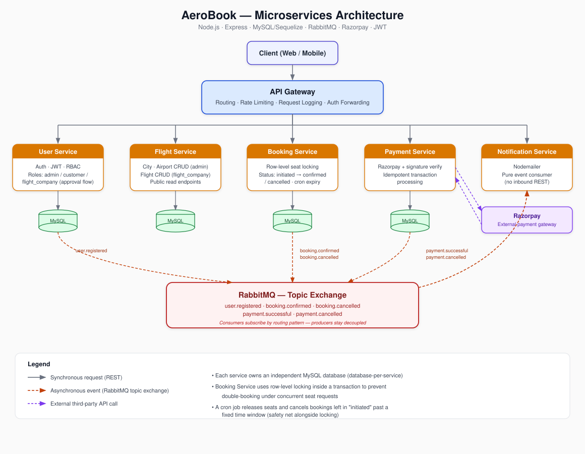

# ✈️ AeroBook — Production-Style Airline Booking Platform (Microservices)

A fully containerized, event-driven airline booking backend built to mirror how
real booking/ticketing systems are engineered — not a CRUD toy project.
Six independently deployable services, transactional seat locking, idempotent
payments, and async messaging via RabbitMQ, all spun up with a single Docker
Compose command.


---

## Table of Contents
- [Quick Start](#quick-start)
- [Why This Project](#why-this-project)
- [Architecture](#architecture)
- [Services](#services)
- [Key Features](#key-features)
- [Key Design Decisions](#key-design-decisions)
- [What This Project Demonstrates](#what-this-project-demonstrates)
- [Tech Stack](#tech-stack)
- [Future Work](#future-work)

---

## Quick Start

The entire platform — all six services, MySQL, and RabbitMQ — comes up with
one command, including database creation, migrations, and seed data.

This repo (`AeroBook`) holds the orchestration layer (`docker-compose.yml` +
`init.sql`). The six service repos need to sit **next to it as sibling
folders**, since Compose builds each service from a relative `../` path.
Clone them all like this:

```bash
mkdir aerobook-platform && cd aerobook-platform

git clone https://github.com/Chandan-kr-tiwari/AeroBook.git
git clone https://github.com/Chandan-kr-tiwari/AeroBook-Flight-Service.git       aeroBook-flight-service
git clone https://github.com/Chandan-kr-tiwari/AeroBook-User-Service.git        aeroBook-user-service
git clone https://github.com/Chandan-kr-tiwari/AeroBook-Booking-Service.git     aeroBook-booking-service
git clone https://github.com/Chandan-kr-tiwari/AeroBook-Payment-Service.git     aeroBook-payment-service
git clone https://github.com/Chandan-kr-tiwari/AeroBook-Notification-Service.git aeroBook-notification-service
git clone https://github.com/Chandan-kr-tiwari/AeroBook-Api-Gateway.git         aeroBook-api-gateway
```

You should end up with this layout:

```
aerobook-platform/
├── AeroBook/                        ← this repo (docker-compose.yml, init.sql)
├── aeroBook-flight-service/
├── aeroBook-user-service/
├── aeroBook-booking-service/
├── aeroBook-payment-service/
├── aeroBook-notification-service/
└── aeroBook-api-gateway/
```

Then, inside `AeroBook/`, create a `.env` file with:

```
JWT_SECRET=your_jwt_secret
JWT_EXPIRES_IN=1d
RAZORPAY_KEY_ID=your_razorpay_key_id
RAZORPAY_KEY_SECRET=your_razorpay_key_secret
GMAIL_EMAIL=your_gmail_address
GMAIL_PASS=your_gmail_app_password
```

And bring the whole stack up:

```bash
cd AeroBook
docker-compose up --build
```

MySQL databases/users for every service and the RabbitMQ exchange come up
automatically via `init.sql` and each service's own migrations/seeders — no
manual DB setup, no per-service `npm install` + `npm run migrate` dance.

| Service | Local URL |
|---|---|
| API Gateway (entry point) | `http://localhost:3005` |
| User Service | `http://localhost:3004` |
| Flight Service | `http://localhost:3000` |
| Booking Service | `http://localhost:3001` |
| Payment Service | `http://localhost:3002` |
| Notification Service | `http://localhost:3003` |
| RabbitMQ management UI | `http://localhost:15672` (`admin` / `admin123`) |


**Note on local repo structure:** the current setup expects six separate
clones kept in sync by folder name. Consolidating these into git submodules
(or a single monorepo) is a natural next step — see [Future Work](#future-work).

---

## Why This Project

AeroBook isn't a single-service CRUD app — it's built to reflect the actual
hard problems in airline/ticketing systems: preventing double-booked seats
under concurrent load, making payment confirmation safe against duplicate
webhook delivery, and letting services evolve independently without a shared
database or tight coupling. Every design decision below exists to solve one
of those real problems, not to pad a feature list.

---

## Architecture


Client → **API Gateway** (routing, rate limiting, request logging) → individual
microservices, each owning its own MySQL database. Services communicate
synchronously via REST for direct requests, and asynchronously via a RabbitMQ
**topic exchange** for cross-service events (booking confirmation, payment
status, notifications).

---

## Services

| Service | Responsibility | Look here first for | Repo |
|---|---|---|---|
| API Gateway | Routing, rate limiting, request logging | Centralized routing & rate-limit middleware | [AeroBook-Api-Gateway](https://github.com/Chandan-kr-tiwari/AeroBook-Api-Gateway) |
| User Service | Authentication, JWT, RBAC, flight-company approval | JWT/RBAC middleware, approval workflow logic | [AeroBook-User-Service](https://github.com/Chandan-kr-tiwari/AeroBook-User-Service) |
| Flight Service | City / Airport / Flight CRUD | Ownership-scoped CRUD (admin vs. flight_company) | [AeroBook-Flight-Service](https://github.com/Chandan-kr-tiwari/AeroBook-Flight-Service) |
| Booking Service | Booking flow, seat locking, cron cleanup | **Row-level locking transaction** for seat allocation, cron-based booking expiry | [AeroBook-Booking-Service](https://github.com/Chandan-kr-tiwari/AeroBook-Booking-Service) |
| Payment Service | Razorpay integration, verification, idempotency | **Idempotency check** before confirming payment, Razorpay signature verification | [AeroBook-Payment-Service](https://github.com/Chandan-kr-tiwari/AeroBook-Payment-Service) |
| Notification Service | Async email notifications via RabbitMQ | RabbitMQ consumer setup, decoupled event handling | [AeroBook-Notification-Service](https://github.com/Chandan-kr-tiwari/AeroBook-Notification-Service) |

---

## Key Features

- **Fully containerized local environment** — a single `docker-compose up`
  boots all six services, MySQL, and RabbitMQ. Per-service databases and
  users are created automatically via an init script, and each service runs
  its own migrations and seeders on startup — no manual DB setup per service.
- **Role-based user system** — three roles (`admin`, `customer`,
  `flight_company`), with `admin` seeded at startup and never
  self-assignable at registration. `flight_company` accounts require admin
  approval before they can create flights, blocking unverified companies
  from listing.
- **Granular CRUD ownership** — admin manages cities/airports, approved
  flight companies manage only their own flights, and flight/city/airport
  listings are exposed as public read endpoints — the same pattern used by
  real-world booking platforms.
- **Authenticated booking flow** — only logged-in users can create bookings.
  Bookings move through `initiated → confirmed / cancelled` states.
- **Concurrency-safe seat locking** — seat status checks and updates happen
  inside a DB transaction using row-level locking, so two concurrent
  requests can never both acquire the same seat; the second request waits
  for the first transaction to resolve, then sees the updated status. A
  scheduled cron job additionally releases seats and cancels bookings stuck
  in `initiated` past a fixed time window.
- **Idempotent payment processing** — payment confirmation checks whether a
  transaction has already been processed before updating booking status,
  preventing duplicate processing if the same payment event is delivered
  more than once.
- **Event-driven architecture with topic exchanges** — services publish to
  a RabbitMQ **topic exchange** rather than direct queues, with events like
  `user.registered`, `booking.confirmed`, `booking.cancelled`,
  `payment.successful`, `payment.cancelled` — so new services can subscribe
  to relevant events independently, with zero changes to producers.
- **Payment verification** — Razorpay integration with server-side
  transaction verification before confirming a booking; success/failure
  triggers events consumed downstream for booking confirmation and
  notifications.
- **Async notifications** — Notification Service consumes relevant events
  off the exchange and sends emails via Nodemailer, fully decoupled from
  the booking/payment request path.

---

## Key Design Decisions

- **Microservices over monolith** — each domain (users, flights, bookings,
  payments, notifications) is independently deployable with its own
  database, avoiding tight coupling between unrelated concerns.
- **Topic exchange over direct queues** — lets new services (e.g. a future
  analytics or loyalty service) subscribe to existing events without any
  change to the producing service; a direct queue setup would require the
  producer to know its consumers in advance.
- **Row-level locking for seat concurrency** — pessimistic locking inside a
  DB transaction guarantees two simultaneous booking requests for the same
  seat can't both succeed, a correctness requirement for any
  booking/ticketing system.
- **Scheduled expiry as a safety net** — even with locking preventing
  double-booking, a cron-based expiry ensures seats aren't held indefinitely
  by abandoned bookings that never complete payment.
- **Idempotency on payment events** — since RabbitMQ deliveries and payment
  callbacks can be redelivered, payment processing checks transaction state
  before acting, so a booking is never double-confirmed and a duplicate
  notification is never sent.
- **Saga-style booking-payment flow** — booking and payment live in separate
  databases, so no cross-service ACID transaction is possible. Failure is
  handled via compensating actions (release seat, cancel booking) driven by
  events, instead of rollback.
- **Approval workflow for flight companies** — prevents any registered user
  from immediately creating flights; admin gatekeeping mirrors real airline
  platform trust models.
- **RBAC via JWT claims** — validated in the User Service, with role checks
  (`admin` / `customer` / `flight_company`) applied per route.
- **Full Dockerized orchestration** — every service, plus MySQL and
  RabbitMQ, is defined in a single `docker-compose.yml`, with migrations and
  seeders wired to run automatically on container startup — the system is
  runnable end-to-end with one command and no manual configuration.

---

## What This Project Demonstrates

| Area | Where it shows up |
|---|---|
| Distributed systems design | Six independently deployable services, database-per-service, saga-style compensation instead of distributed transactions |
| Concurrency & data integrity | Row-level locking for seat allocation, idempotent payment confirmation |
| Async messaging | RabbitMQ topic exchange, event-driven consumers decoupled from the request path |
| Security & access control | JWT-based auth, RBAC across three roles, admin approval gating |
| Real-world payment handling | Razorpay integration with server-side verification and duplicate-delivery safety |
| DevOps / deployability | Full Docker Compose orchestration with automated migrations and seeders |
| API design | Gateway-based routing, rate limiting, centralized request logging |

---

## Tech Stack
Node.js, Express, MySQL, Sequelize, RabbitMQ, Razorpay, JWT, Nodemailer, Cron Scheduler, Docker & Docker Compose

---

## Future Work
- Consolidate the six service repos into git submodules (or a monorepo) so
  the whole platform comes up from a single `git clone --recursive`, instead
  of cloning six repos by hand into matching folder names
- API documentation (Swagger/OpenAPI or a published Postman collection) for each service
- Centralized structured logging / observability (e.g. correlation IDs across service calls)
- Automated test suite (unit + integration) with CI pipeline
- Horizontal scaling notes / load-testing results for the seat-locking path
- Move hardcoded local credentials in `init.sql` behind `.env`-driven values, matching the app services' existing pattern

---

## Running Locally
See [Quick Start](#quick-start) above for the one-command Docker setup. Each
service also has standalone setup instructions in its respective repo, linked
in the [Services](#services) table, for running or debugging a single service
outside the full stack.
